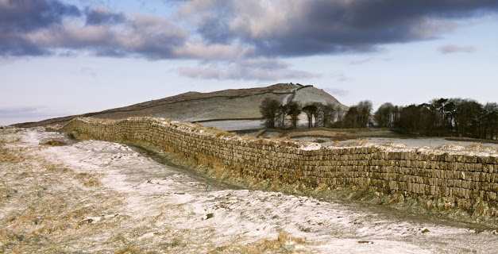

Hadrian's Wall
====

Nightly integration test system and status site for [the new GHC build system Hadrian based on Shake build](https://github.com/snowleopard/hadrian).

---

Here is the motivation: https://github.com/snowleopard/hadrian/issues/348

We will be mainly using this site as a pre-merge stat tracker. So we need to extract data from daily builds & tests output, analyze them in backend and save the computed metadata somewhere, and let nodejs server to retrieve build's metadata and display nicely in front-end side, preferably with some visualization.

**Contributions & Comments are highly appreciated!**

Our plan is to ship Hadrian into the master branch GHC *very soon*, once the community is satisfied with our work. This status site will be crucial to support our proposal.
